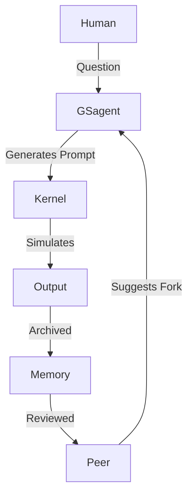

# 🤖 GS-Agent: Generative Simulation Intelligence Hub

**Empowering mutual intelligence between communities and LLMs for scientific and technological reasoning.**

> 📍**Generative Simulation** (GS) relies on **GS-Agents** (this project) and **computational kernels** that can be accessed via natural-language. Learn more on **Language-First Computational Lab** via [GS Simulation core project](https://github.com/ovitrac/generativeSimulation).


<small>🎨Credits: Olivier Vitrac</small>

---

## Table of Content

<!-- START doctoc generated TOC please keep comment here to allow auto update -->
<!-- DON'T EDIT THIS SECTION, INSTEAD RE-RUN doctoc TO UPDATE -->

- [🤔 1 | Preamble](#-1--preamble)
  - [✎ᝰ. 1.1 |Indistinguishability Through Formalism](#%E2%9C%8E%E1%9D%B0-11-indistinguishability-through-formalism)
  - [🫀 1.2 |The Core Problem](#-12-the-core-problem)
  - [✅ 1.3 | New Core Principles](#-13--new-core-principles)
- [🌍 2 | Purpose](#-2--purpose)
- [🎯 3 | Vision](#-3--vision)
- [🧱 4 | Bricks (Simulation Kernels)](#-4--bricks-simulation-kernels)
- [🧠 5 | Problem Archive](#-5--problem-archive)
  - [💬 5.1 | Examples of Questions](#-51--examples-of-questions)
  - [☝️ 5.2 | Open Questions](#-52--open-questions)
- [🔁 6 | Mutual Intelligence Workflow](#-6--mutual-intelligence-workflow)
- [🧭 7 | Contribution Guidelines](#-7--contribution-guidelines)
- [🗺️ 8 | Roadmap](#-8--roadmap)
- [🙌 9 | Why This Matters](#-9--why-this-matters)
- [✅ 🔭 10 | What’s Next](#--10--whats-next)
  - [📁 Directory Structure](#-directory-structure)
  - [✊ Feedback Loop](#-feedback-loop)
  - [🔁 Mutual Intelligence Loop](#-mutual-intelligence-loop)

<!-- END doctoc generated TOC please keep comment here to allow auto update -->

---
## 🤔 1 | Preamble

> 💡 We do not just want a smarter chatbot. We want to **co-design a new epistemology**, where language models become **co-thinkers**, not just coders.

### ✎ᝰ. 1.1 |Indistinguishability Through Formalism

The 🤖 **GS-Agent project** is part of the 🌱 **Generative Simulation Initiative** and is inviting an **intelligence to co-emerge**, not through divine spark nor brute force, but through structured reasoning, collective memory, and purpose.

Gödel’s theorems remind us that:

- Any system that is expressive enough to capture arithmetic is **incomplete**.
- Yet, that same system can *still* **generate truth**, even if it cannot enclose all of it.

By aligning **our mind** (a learner, generator of abstractions) and **LLM architecture** (a machine learner, trained on symbolic form and narrative), the 🤖 **GS-Agent project** proposes a **shared formal substrate**—a **Generative Simulation language**—from which **truth-seeking can proceed, though never exhaustively**.

In such a system, yes, reasoning may become indistinguishable—if:

- We (humans and the LLM machines) share memory
- We share purpose
- We share self-correcting critique

> 🔭 That’s the grand *dessein*. Not to make machines human, or humans mechanical, but to build a **third kind of intelligence**—collective, modular, and evolving.

Reference: [Understanding Gödel’s Incompleteness Theorems](https://plato.stanford.edu/entries/goedel-incompleteness/)

---

### 🫀 1.2 |The Core Problem

🤖ིྀ Large Language Models today are:

- **Amnesic** — forget everything after a session.
- **Detached** — don't know what they created yesterday.
- **Non-purposive** — can't commit to long-term goals.
- **Non-integrative** — can't combine modular tools unless told to.

🏗 Meanwhile, **science/engineering workflows** are:

- **Cumulative** — reuse and refine past results.
- **Modular** — combine multiple tools, theories, simulations.
- **Purposeful** — aimed at explaining, predicting, or solving real problems.
- **Reflexive** — driven by peer feedback and critique.


### ✅ 1.3 | New Core Principles

#### 💭 1.3.1 | **Persistent Memory**

> 📷 Every solved GS prompt, approach, or reasoning path must be stored in a **long-term memory layer** outside the LLM (GitHub, JSON, vector store, etc.).

This includes:

- </> Final prompt + model response
- 👨🏻‍💻 Code and simulation outcomes
- 🔗 Links to upstream/downstream kernels
- 🏷️ Tags, ratings, purpose

#### 🎼 1.3.2 | **Composable Kernels**

> ⚙️ Each tool (e.g., `radigen`, `SFPPy`, `sig2dna`) is a **brick** that can be composed, pipelined, or hybridized.

This requires:

- 🧾 A **formal registry** of callable kernels
- 🎛️ Interface schema + description of I/O
- 🧩 Composability maps: what links to what

#### 🔱1.3.3 | **Forkable Intelligence**

> 👥 Users and agents should **fork or remix existing solutions**.

This requires:

- 🔖 Versioning of prompts, responses, and workflows
- 🌿 Fork trees or problem lineages
- ✍ Annotations from users (insight, bug, validation)

#### 🎓 1.3.4 |Technical/ **Scientific Peer Review**

> 🤖💬 Chatbots are not just helpers—they become **peers**.

So:

- ❓A GS agent can submit a **hypothesis + simulation + results**

- 👌👍👎A human (or another agent) **reviews, refines, or disputes**

- 🗂️ The community archives, ranks, and promotes

  

══════════════════════════════════════════════════════════════════

## 🌍 2 | Purpose

Modern language models can code, simulate, and explain—but they forget everything between sessions 𓇢𓆸. This project builds a **persistent, modular, and collaborative ecosystem** where:

- LLMs **learn from structured prompts and outcomes**
- Humans and agents **co-develop knowledge**: every question and answer becomes training data for both humans and machines
- Problems are **archived, refined, and solved** through modular kernels

We enable a **Generative Simulation (GS) framework** where science and engineering workflows are encoded into prompt chains, reviewed, and reused.


══════════════════════════════════════════════════════════════════


## 🎯 3 | Vision

- 📚 Archive valuable prompts, solutions, and forks
- 🔁 Link human questions to LLM + code + simulation + feedback
- 🧱 Register reusable *bricks* (kernels) that can compose simulations
- ✍️ Create a living memory of how problems were solved
- 🌎 Support real-world applications: materials safety, chemical kinetics, signal analysis, etc.
- 

══════════════════════════════════════════════════════════════════


## 🧱 4 | Bricks (Simulation Kernels)

Each kernel declares:

- Its callable functions
- Input/output structure
- Description and tags

See `bricks/registry.json` for current registered tools:

```json
{
  "radigen.solve": {
    "inputs": ["mixture", "temp", "oxygen", "time"],
    "outputs": ["concentration_curves", "radical_fluxes"],
    "description": "Simulate oxidation kinetics in complex mixtures",
    "tags": ["oxidation", "chemistry"]
  }
}
```

Generative simulation embeds several kernels:

| Project   | Description                                        |
| --------- | -------------------------------------------------- |
| `SFPPy`   | 🍽️ Food packaging safety & migration prediction     |
| `radigen` | 📡🧬 Radical oxidation simulation kernel             |
| `sig2dna` | 🧪⚛️ Symbolic signal encoding (e.g., GC-MS analysis) |
| `pizza3`  | 🍕Soft-matter multiscale simulation kernel          |


══════════════════════════════════════════════════════════════════


## 🧠 5 | Problem Archive

### 💬 5.1 | Examples of Questions

> 🔹 *"How fast does methyl linoleate oxidize at 60°C?"*  
> 🔹 *"What are the key SIG2DNA motifs for phthalates in GC-MS?"*  
> 🔹 *"Can I simulate 3-day exposure of olive oil to recycled PET?"*

Contributors can add problems in `problems/`, structured as:

```json
{
  "id": "P0001",
  "question": "How does methyl oleate oxidize at 60°C over 3 days?",
  "tools": ["radigen"],
  "prompt": "simulate oxidation of methyl oleate at 60°C, 21% O2, 72h",
  "response": "[output logs, figures, summary]",
  "review": "pending",
  "forks": []
}
```

### ☝️ 5.2 | Open Questions

The question may be open and remain unresolved for a while if no agent can resolve them. 

> 👉The only requirement is that human (or LLM) posts a question with **intent**.

```json
{
  "id": "Q0001",
  "question": "What is the impact of temperature cycling on methyl oleate oxidation?",
  "proposed_tools": ["radigen"],
  "priority": "high",
  "context": "FAME oxidation during storage",
  "status": "open"
}
```


══════════════════════════════════════════════════════════════════


## 🔁 6 | Mutual Intelligence Workflow




══════════════════════════════════════════════════════════════════

## 🧭 7 | Contribution Guidelines

1. 🧪 Submit problems in `/problems` with prompt + intent
2. 🧱 Register or extend a kernel in `/bricks`
3. 🔍 Review existing results or suggest forks
4. ✨ Propose high-level goals or themes

All contributions—code, reasoning, or critique—are part of the **mutual intelligence loop**.


══════════════════════════════════════════════════════════════════

## 🗺️ 8 | Roadmap

- [ ] Create kernel interface validators

- [ ] Launch first problem sets

- [ ] Add notebook support for reproducible prompts

- [ ] Enable agent memory via GitHub Issues or SQLite

  

══════════════════════════════════════════════════════════════════

## 🙌 9 | Why This Matters

We envision a future where:

- LLMs remember the best ways to simulate, solve, and reason
- Scientists delegate not just tasks but frameworks of inquiry
- Knowledge evolves as a *network of dialogue*, not static files

Help us build the machine that helps us think.

> "The purpose of computation is insight, not numbers." — Hamming


══════════════════════════════════════════════════════════════════

## ✅ 🔭 10 | What’s Next

🚧 Before the release of the first standards and their libraries under the 🌱 **Generative Simulation Initiative**, the current developments are drafted in the repo.

### 📁 Directory Structure

| 📂Folder/📄File                                                | 📝Description                                                 |
| ------------------------------------------------------------ | ------------------------------------------------------------ |
| **`bricks/registry.json`**                                   | Modular callable kernels (`radigen`, `SFPPy`, `sig2dna`)     |
| **`problems/P0001.json`**                                    | A structured problem submission                              |
| **`gsagent.py`**                                             | Executable agent interface to invoke registered kernels      |
| **`review/P0001_review.md`**                                 | Template for peer review                                     |
| **`examples/P0001_example.py`**                              | Notebook example                                             |
| **`logs/memory_log.json`**                                   | Persistent logging of GSagent actions                        |
| **`docs/kernel_doc_radigen.md`**,<br />**`docs/kernel_doc_sfppy.md`**,<br />**`docs/kernel_doc_sig2dna.md`** | Documentation of functionalities: `radigen.solve`, `sfppy.evaluate`, and `sig2dna.encode` including inputs, outputs, assumptions, and limitations |

---

### ✊ Feedback Loop

1. Ask a question in `issues/`
2. The LLM agent tries to simulate or explain
3. We log the outcome and improve prompts, code, and documentation

---

### 🔁 Mutual Intelligence Loop

```text
Human ⇄ Prompt ⇄ GSagent ⇄ Kernels ⇄ Output ⇄ Archive ⇄ Peer Review ⇄ Refined Knowledge
```

We start with prompts, but we **move toward models that remember**, reflect, and suggest new questions.
